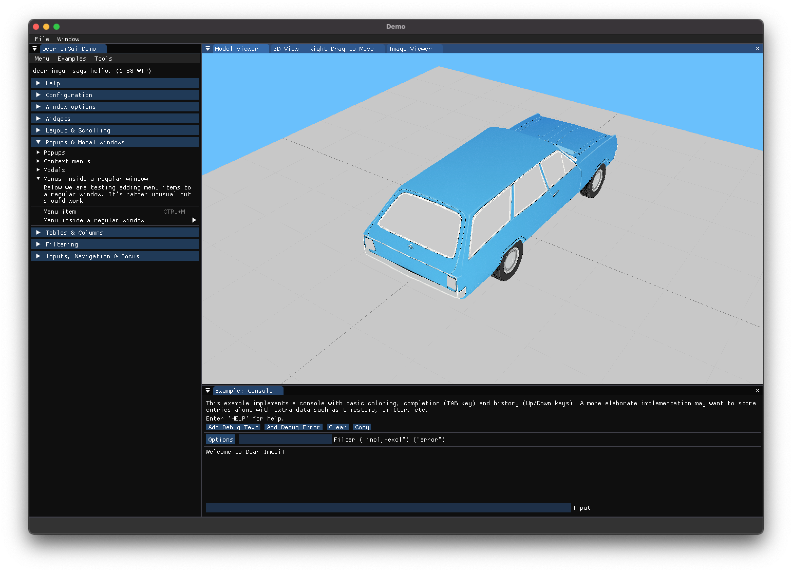

# __RaylibExtras__ 

<!--  -->


Modified version of https://github.com/JeffM2501/raylibExtras.

This project is under the [**ZLib/libpng License**](https://github.com/JeffM2501/raylibExtras/blob/index/LICENSE)
 
__RaylibExtras__ provides an easy way to create your 2D/3D application based on the famous [__Raylib__](https://github.com/raysan5/raylib) library with a cool user interface based on [__Dear ImGui__](https://github.com/ocornut/imgui/tree/docking).



# Table of content
- [__RaylibExtras__](#raylibextras)
- [Table of content](#table-of-content)
- [__How to use__](#how-to-use)
  - [__Ubuntu build using CMake__](#ubuntu-build-using-cmake)
    - [Dependencies](#dependencies)
  - [__MacOS build using CMake__](#macos-build-using-cmake)
    - [Dependencies](#dependencies-1)
  - [__Notes__](#notes)
  - [Building Windows (__NOT TESTED__)](#building-windows-not-tested)
    - [build on windows with visual studio](#build-on-windows-with-visual-studio)
- [Contributors](#contributors)

# __How to use__
Clone repository and submodules.
```
git clone --recursive https://github.com/cristianostrobbe/raylibExtras
```

## __Ubuntu build using CMake__

### Dependencies
```
sudo apt install -y libglfw3 libglfw3-dev
```

Create build directory
```
mkdir build && cd build
```
And then the cmake configuration
```
cmake -D CMAKE_BUILD_TYPE=Release \
-D BUILD_ALL_EXAMPLES=ON \
-D USE_EXTERNAL_GLFW=ON \
-D WITH_PIC=ON \
-D DEBUG_MODE=OFF ..
```
And finally 
```
make
```
The compiled examples will be placed inside the **bin** directory.

## __MacOS build using CMake__

### Dependencies
```
brew install make
brew install cmake
brew install glfw
```

Create build directory
```
mkdir build && cd build
```
And then the cmake configuration
```
cmake -D CMAKE_BUILD_TYPE=Release \
-D BUILD_ALL_EXAMPLES=ON \
-D USE_EXTERNAL_GLFW=ON \
-D WITH_PIC=ON \
-D DEBUG_MODE=OFF ..
```
And finally 
```
make
```
The compiled examples will be placed inside the **bin** directory.

## __Notes__
__Does not work with MacOS window scaling!__

To overcome this problem you can disable windows scaling using [__displayplacer__](https://github.com/jakehilborn/displayplacer) tool. Please read carefully installation guide and usage. The following command is the one that I used to set external monitor resolution, frame rate and scaling mode.
```
displayplacer "id:MONITOR_ID res:WIDTHxHEIGHT hz:FPS scaling:off"
```
Monitor id can be retrieve from:
```
displayplacer list
```

## Building Windows (__NOT TESTED__)
Raylib Extras uses premake, a premake5.lua file is included in the repository. Simply use it to create the build files for your target system.
See https://premake.github.io/ for more info.
The repository also uses raylib as a submodule in the raylib folder so it can build the examples.

Examples will be included in the project files generated by premake.

### build on windows with visual studio
1) download premake5.exe from https://premake.github.io/
2) copy it into the raylib extras folder
3) run premake.bat

Premake will then generate all the visual studio projects needed. You can open them with the RaylibExtras.sln that will be created in the root folder of the repository.

# Contributors
Many thanks to those that have submited fixes and updates to Raylib Extras.

 - [**Julianiolo**](https://github.com/Julianiolo)
 - [**NotManyIdeasDev**](https://github.com/NotManyIdeasDev)
 - [**MarcoGMaia**](https://github.com/marcogmaia)
 - [**OkiStuff**](https://github.com/OkiStuff)

Do you want to contribute to **raylibExtras**? Check out [**CONTRIBUTING**](https://github.com/JeffM2501/raylibExtras/blob/index/CONTRIBUTING)